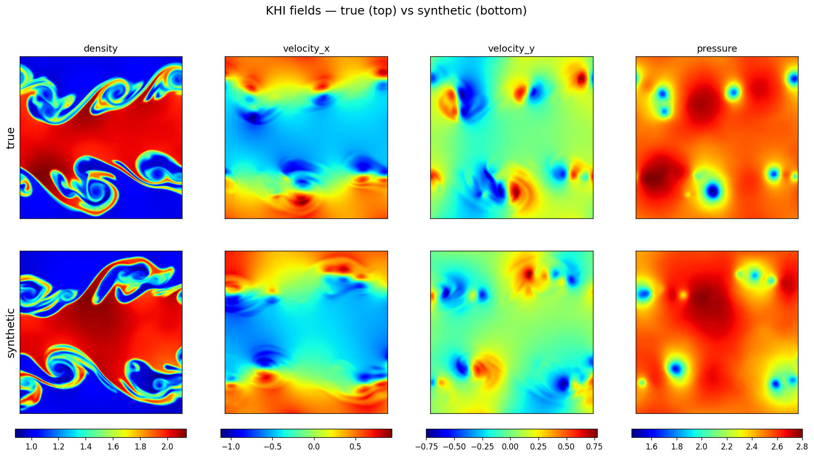
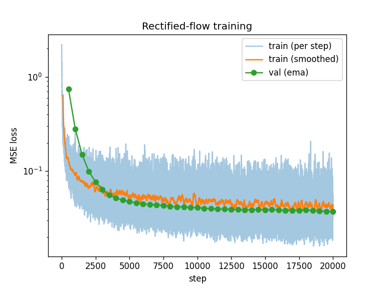
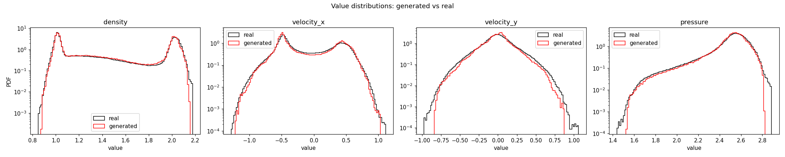
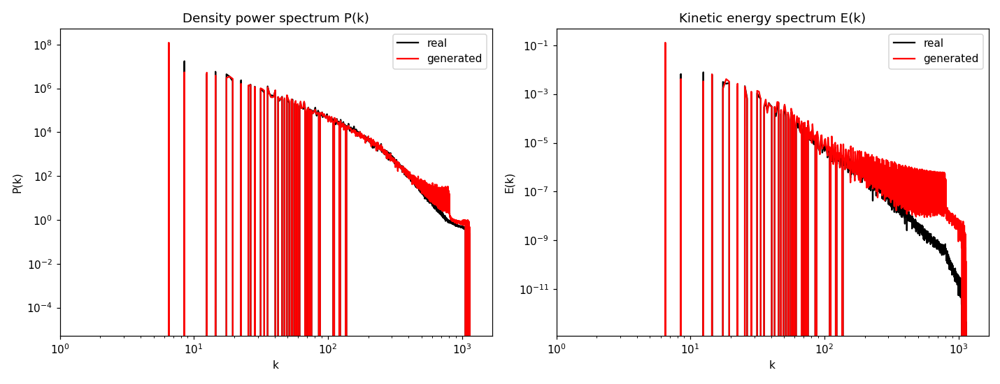

# KHI sampler

A generative ML model that replaces the classical **"seed + forward-simulate"**
pipeline for Kelvin-Helmholtz Instability (KHI) simulations. Instead of drawing
a random perturbation seed and running a hydrodynamics solver forward in time,
the model **directly samples the full 2D final-time field** — density,
velocity_x, velocity_y, and pressure — at 256×256 resolution in a single
network integration.



*Top: a true simulation. Bottom: a synthetic sample drawn from the model. The
four channels are shown on a shared per-channel colour scale.*

---

## 1. Problem setup

The training data are KHI final states produced with the
[`astronomix`](https://github.com/leo1200/astronomix) finite-volume
hydrodynamics code:

- **Domain:** unit box, 256×256 cells, periodic boundaries, γ = 5/3.
- **Initial condition:** a central slab (`0.25 < y < 0.75`) with density ρ = 2
  and shear velocity `u_x = -0.5`, embedded in a background of ρ = 1,
  `u_x = +0.5`. The instability is seeded by a random, band-limited Fourier
  `u_y` perturbation localised on the two shear layers (modes k = 1…8, random
  amplitudes with a spectral slope and random phases).
- **Integration:** solved to `t_end = 2.0` with the HYBRID-HLLC Riemann solver
  and a double-minmod limiter (CFL = 0.4). Each simulation yields a
  `(4, 256, 256)` array (density, v_x, v_y, pressure).

Only the random seed (the `u_y` perturbation) differs between samples, so the
map from noise to a physically valid final state is exactly what a generative
model can learn. **1000 samples** were generated for the baseline.

## 2. Generative model: rectified flow

We use a **rectified-flow** (a.k.a. flow-matching) objective. Let `x0 ∼ N(0, I)`
be Gaussian noise and `x1` a (normalised) KHI final state. Define the linear
interpolant

```
x_t = (1 - t) · x0 + t · x1,   t ∈ [0, 1]
```

The network is trained to predict the constant transport velocity along this
straight path:

```
v_target = x1 - x0
loss = E_{x0, x1, t} ‖ v_θ(x_t, t) - (x1 - x0) ‖²
```

Sampling then starts from pure noise (`t = 0`) and integrates the learned ODE
`dx/dt = v_θ(x, t)` to `t = 1` with a **Heun (RK2)** integrator (100 steps).

**Why rectified flow.** The straight-line target makes the velocity field nearly
constant along trajectories, which gives stable training and good samples with
few integration steps — a good fit for a first working baseline, and simpler
than a stochastic diffusion sampler.

## 3. Network architecture

The velocity field `v_θ` is a **U-Net** operating on the 4-channel field
(`unet_models/unet_flow_film.py`), built from modern diffusion-model components:

- **DDPM-style residual blocks** — each block is
  `GroupNorm → SiLU → 3×3 conv → FiLM → GroupNorm → SiLU → 3×3 conv`, with a
  `1×1` conv skip when the channel count changes. Residual connections and
  GroupNorm keep training stable at 256².
- **FiLM time conditioning** — the scalar time `t` is turned into a sinusoidal
  (DDPM-style) Fourier embedding, processed by a small MLP, and mapped by each
  block to a per-channel **(scale, shift)** pair applied at full strength. Time
  information is essential for a flow model, so FiLM is *not* attenuated.
- **Encoder / decoder** — four encoder stages with widths
  `64 → 128 → 256 → 384` at resolutions `256 → 128 → 64 → 32`, a `512`-wide
  bottleneck at `16×16`, and a symmetric decoder with skip connections.
  Downsampling uses strided convolutions; upsampling uses bilinear resize + conv.

Total size: **≈ 30 M parameters**.

## 4. Training techniques

Implemented in `training.py`:

- **Per-channel standardisation** — each of the four physical channels is
  standardised to zero mean / unit variance over the dataset; the statistics are
  saved to `norm_stats.npz` and inverted at sampling time so outputs come back in
  physical units.
- **EMA weights** — an exponential moving average (decay 0.999) of the
  parameters is tracked and used for all sampling; this materially reduces
  sample noise versus the raw weights.
- **AdamW + gradient clipping** — learning rate 2e-4, weight decay 1e-4, global
  gradient-norm clipping at 1.0.
- **Optimisation** — 20 000 steps, batch size 16, with a held-out validation
  split (10%) evaluated on the EMA weights.
- JAX / Equinox / Optax throughout; GPUs are selected automatically with
  `autocvd` (free GPUs only).



The validation MSE (on EMA weights) drops from ≈ 0.74 to ≈ 0.037 and plateaus.

## 5. Results

The baseline (1000 samples, 30 M params, 20 k steps) produces synthetic fields
that are **visually indistinguishable in structure from real KHI states** and
match the real statistics closely.

**Value distributions.** Per-channel PDFs of generated vs. real fields agree
across three–four orders of magnitude, including the bimodal density (peaks at
ρ ≈ 1 and ρ ≈ 2), the bimodal `v_x` (the two shear speeds at ±0.5), the peaked
`v_y`, and the pressure distribution with its low-pressure tail.



**Spectra.** The density power spectrum P(k) matches across scales, and the
kinetic energy spectrum E(k) matches through the energy-containing range
(k ≲ 100).



**Physical consistency.** Within a single synthetic sample the four channels are
mutually consistent — density vortex cores line up with pressure minima and with
`v_y` dipoles — so the model has learned the coupled hydrodynamics, not just the
per-channel marginals.

**Known limitations.** The generated velocity fields have slightly thin extreme
tails and a small excess of small-scale (high-k) velocity power (E(k) ~ 10⁻⁶–10⁻⁸,
i.e. 5–8 orders of magnitude below the peak) — the mild high-frequency roughness
typical of generative image models.

**Possible improvements:** expand the dataset toward 100 k samples, deepen the
architecture or add an attention bottleneck, and run hyperparameter tuning.

---

## Environment

Use the `jf1uids` conda env (has `astronomix` + `optax` + `autocvd` + `jax`):

```bash
PY=/export/home/lstorcks/.local/share/mamba/envs/jf1uids/bin/python
```

Run one GPU job at a time — concurrent jobs contend for the single free card.

## Pipeline

```bash
# 1. Generate the dataset -> data/ (symlink to a large partition)
$PY data_generation/generate_data.py --num-samples 1000 --batch-size 20

# 2. Train the rectified-flow model (saves checkpoints + norm_stats.npz)
$PY training.py --steps 20000 --batch-size 16

# 3. Sample from the trained EMA model (writes overview_2x4.png etc.)
$PY sample.py --ckpt unet_checkpoints/unet_ema_final.eqx --num-samples 8

# 4. Physical analysis: PDFs + density/energy spectra, generated vs real
$PY analysis.py
```

## GPU memory / avoiding OOM

Training a 256² U-Net can OOM on a shared GPU, especially on newer JAX/XLA.
Three mitigations are built into the scripts so nothing needs to be set on the
command line:

- **Conv autotuning disabled** (`XLA_FLAGS=--xla_gpu_autotune_level=0`, set via
  `os.environ` before JAX is imported). XLA's convolution autotuner probes
  30–40 GiB scratch buffers just to benchmark cuDNN algorithms; on a contended
  card (or with newer XLA that runs these probes on many compile threads at
  once) that is a hard OOM. The default cuDNN heuristic is used instead —
  marginally slower per step, faster to compile, never OOMs.
- **On-demand allocation** (`XLA_PYTHON_CLIENT_PREALLOCATE=false`) so a job
  grabs only what it needs instead of ~75% of the card, coexisting with others.
- **Gradient checkpointing** on the ResBlocks (`unet_flow_film.USE_CHECKPOINT`,
  default on; disable with `KHI_CHECKPOINT=0`). Recomputes activations in the
  backward pass. On JAX 0.10 this brings the batch-16 train step to ~5.7 GB.

Measured peak for the batch-16 train step: **~5.7 GB** with checkpointing
(≈8.2 GB without). If you still hit OOM, drop `--batch-size` to 8.

Note: setting `XLA_FLAGS=…` on its own shell line does **not** export it to the
`python` process — prefix the command (`XLA_FLAGS=… python training.py`) or
`export` it. The scripts already set it internally, so this is only relevant if
you override it manually.

## Files

| File | Role |
|------|------|
| `data_generation/generate_data.py` | astronomix KHI sims → `data/final_state_*.npy` `(4,256,256)` |
| `unet_models/unet_flow_film.py` | rectified-flow U-Net (DDPM-style ResBlocks + FiLM + gradient checkpointing) |
| `training.py` | per-channel normalisation (stats saved), EMA weights, grad clipping |
| `sample.py` | Heun sampler + denormalisation + `overview_2x4.png` (true vs synthetic) |
| `analysis.py` | value PDFs and density/kinetic-energy spectra, generated vs real |
| `docs/` | result figures embedded in this report |
